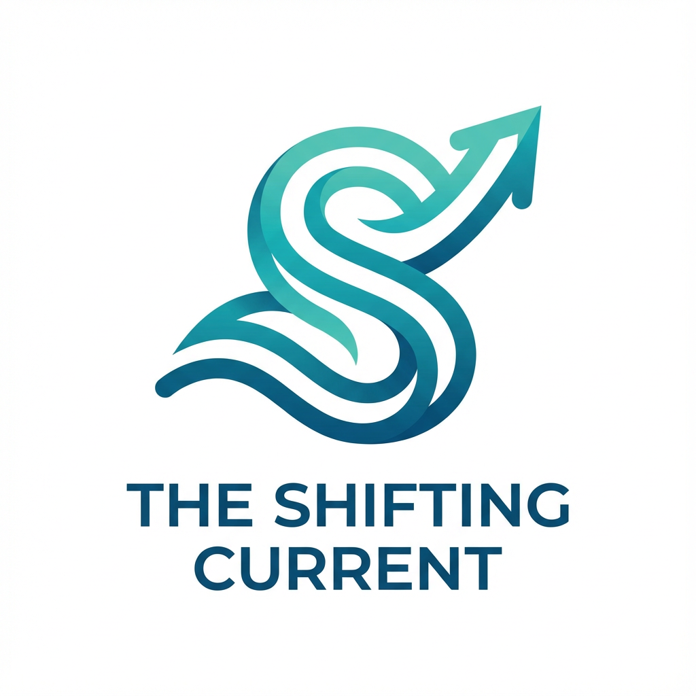

# Shifting Current — AI Workspace Template

A ready-to-clone personal AI workspace. Obsidian for knowledge management, your AI assistant for automation. One folder, both tools, same files.

## What This Is

This is a template repository for [The Shifting Current](https://theshiftingcurrent.com) AI consulting workshops. Clone it, open it with Obsidian, connect your AI assistant, and you have a working system with five built-in workflows.

**No coding required.** Everything is plain text files that both you and your AI can read and write.

## Prerequisites

Install these before cloning:

**Mac:**
1. Git — `xcode-select --install`
2. Node.js — [nodejs.org](https://nodejs.org) LTS
3. Bun — `curl -fsSL https://bun.sh/install | bash`
4. [Obsidian](https://obsidian.md)
5. An AI assistant (Claude Code, Augment, or similar)

**Windows:**
1. Git — [git-scm.com](https://git-scm.com) (includes Git Bash)
2. Node.js — [nodejs.org](https://nodejs.org) LTS
3. Bun — `powershell -c "irm bun.sh/install.ps1 | iex"`
4. [Obsidian](https://obsidian.md)
5. An AI assistant (Claude Code, Augment, or similar)

## Getting Started

```bash
git clone https://github.com/andywoodruff6/shifting-current-template.git my-vault
```

1. Open `my-vault/` as a vault in Obsidian
2. Open the **Workshop Roadmap** in `01_Capture/` — it walks you through everything
3. Connect your AI assistant (see `04_Assets/prompts/00-setup-guide.md`)

## What's Inside

```
01_Capture/          Daily notes, quick capture, workshop roadmap
02_Projects/         Active projects, workshop walkthrough
03_Archives/         People files, transcripts, reference material
04_Assets/           Prompt templates (your 5 workflows), diagrams
99_Templates/        Obsidian templates (daily note, basic note)
AGENTS.md            AI behavioral rules (see below)
```

## The Five Workflows

Prompt templates in `04_Assets/prompts/` — copy into your AI chat and go:

1. **Meeting Notes** — Paste a transcript, get structured notes + automatic people file updates
2. **Visual Content** — AI writes image generation prompts you take to any image tool
3. **Newsletter / Report** — Raw content in, polished formatted output out
4. **Knowledge Capture** — Organize and file information into your vault
5. **Daily Kickoff** — AI reviews your vault and helps plan your day

## AGENTS.md — Teaching Your AI

`AGENTS.md` is where you teach your AI assistant how to work in your vault. Your AI reads this file for behavioral rules.

**What goes in AGENTS.md:**
- Tag rules — "Only use these tags: meeting, project, person, idea, stakeholder"
- Task conventions — "Tasks use priorities: urgent, high, medium, low"
- Naming conventions — "People files use full first and last names"
- Formatting rules — "Always include frontmatter with tags and date_created"
- Prohibitions — "Never create files in 99_Templates/ without asking"

**What does NOT go in AGENTS.md:**
- File paths or folder routing (the AI reads the folder structure itself)
- Tool configuration (that's in `.obsidian/` and `.claude/`)
- General knowledge (the AI already knows how Obsidian and markdown work)
- Workflow instructions (those live in `04_Assets/prompts/`)

**The rule of thumb:** only put things in AGENTS.md that the AI gets wrong. When it uses the wrong tag, creates a file in the wrong format, or breaks a convention you care about — add a rule. Start minimal and grow it over time.

## Sample Data

This template includes sample data for workshop demos:
- **People files** — Alice Smith and Bob Thompson in `03_Archives/People/`
- **Sample transcript** — A meeting transcript in `03_Archives/01_transcripts/` for testing the meeting notes workflow

You can delete these after your workshop or keep them as reference.

## Workshop Materials

The `01_Capture/Workshop Roadmap.md` file is your guide. It links to five workshop parts that walk through the system progressively:

1. Obsidian basics (links, templates, tasks)
2. Frontmatter and structure (metadata, Bases)
3. Using AI with Obsidian (connecting your assistant)
4. Built-in workflows (the five prompt templates)
5. Building your own workflows (extending the system)

## License

MIT

## Contact

Built by [Andy Woodruff](https://theshiftingcurrent.com). Questions? Reach out.
